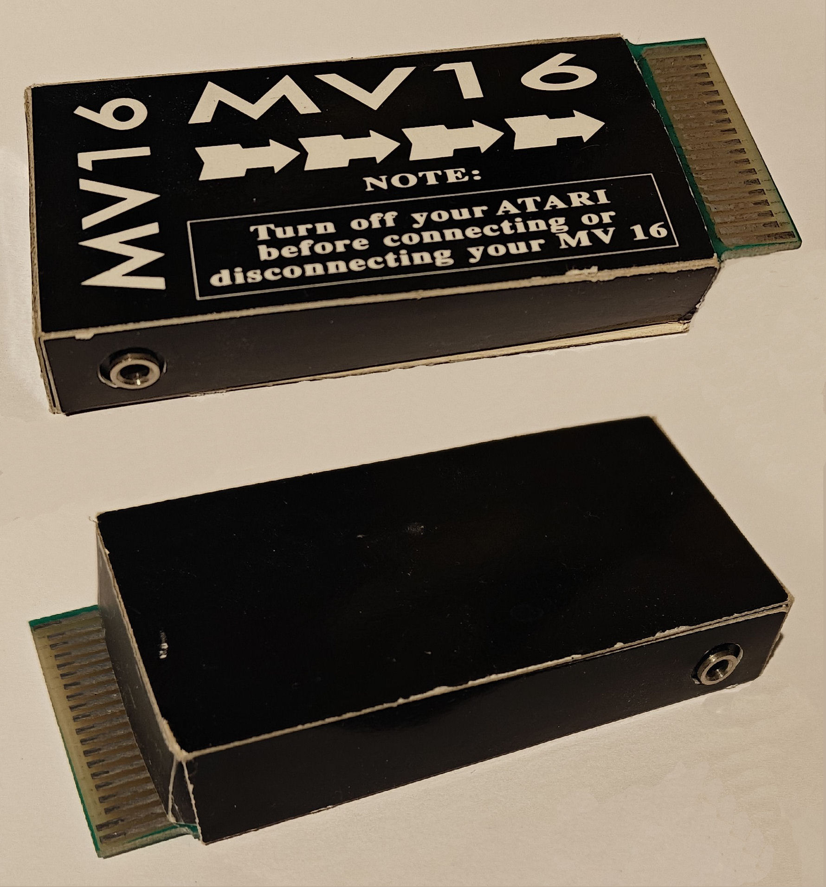
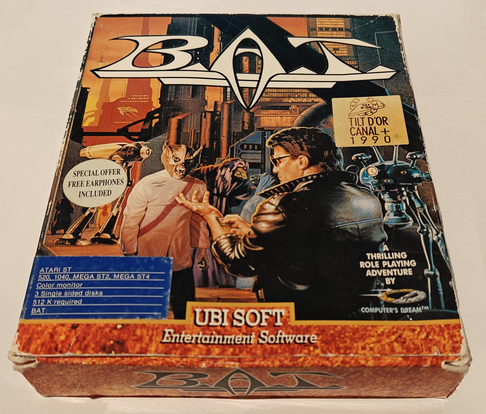
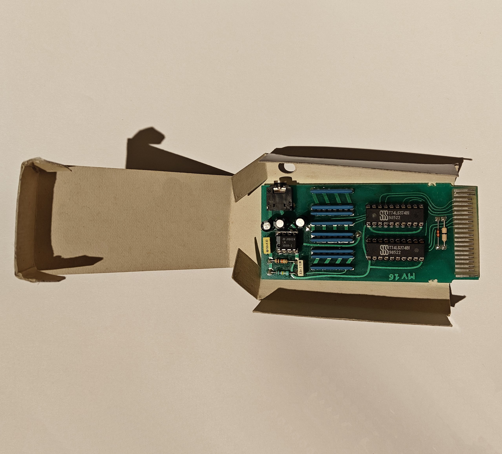
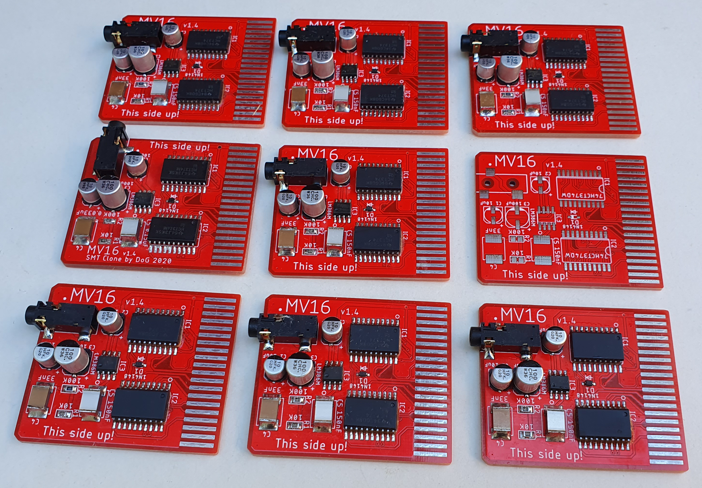
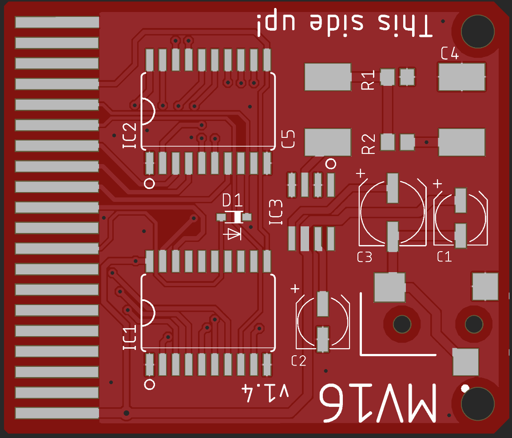
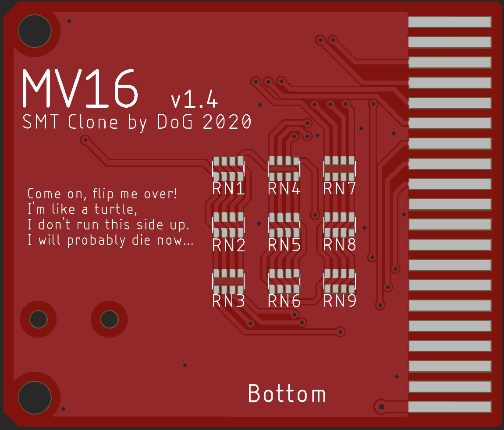

<h1 align="center">
MV16 smt remake
</h1>

<h2 align="center">
Atari ST MV16 cartridge by Computer's Dream and released by Ubi Soft. 
It was included with the game B.A.T. (Bureau of Astral Troubleshooters)
</h2>

---
 
   

---

 

---

## Smaller then original  

I bought the original box with cartridge a while ago with the intention to reverse engineer it. The new SMT version was done around summer 2020 (peak covid time) and is more then half as long as the original. The cartridge is a 12 bit resistor ladder with a amplifier chip. Very cheap with cardboard enclosure for the cartridge. The original seem to use very specific capacitor (Polyphenylene Sulfide, Polyethylene Naphthalate?) as well. Common for audio circuits perhaps? I don't know if that is needed or make the sound better. The sound is pretty terrible and noisy but better then YM on the ST I guess. Build [Microdeal Stereo Playback](https://github.com/tomtebloss/Microdeal_Stereo_Playback) if you want better sound.

---

## BOM

Bill of material (BOM is included in gerber zip as well as text files in the 'Gerbers' directory)

| Quantity | Parts    | Value                    | Package             | Device/Description                                |
| :---     | :---     | :---                     | :---                | :---                                              |
| 9        | RN1-RN9  | 4.7 kΩ (1% or better) | TC164-FR-074K7L     | Array Chip Resistor. Use 1% or better if you can  |
| 1        | R1       | 10 kΩ                    | R0805               | Resistor, Carbon film                             |
| 1        | R2       | 100 kΩ                   | R0805               | Resistor, Carbon film                             |
| 2        | C1, C2   | 10 µF                    | UD-5X5,8_NICHICON   | Electrolytic Capacitor, 50V on or higher, I used EEE-FK1H100UR                          |
| 1        | C3       | 100 µF                   | UD-6,3X7,7_NICHICON | Electrolytic Capacitor, 16V or higher, EEE-1VA101XP                                     |
| 1        | C4       | 33 nF                    | E/7260-38_NP, 2416  | Film Capacitor, Polyphenylene Sulfide (PPS),  Metallized - Stacked, 100V              |
| 1        | C5       | 150 nF                   | E/7260-38_NP, 2416  | Film Capacitor, Polyester, Polyethylene Naphthalate (PEN),  Metallized - Stacked, 63V |
| 1        | D1       | 1N4148WT                 | SOD523              | Schottky barrier diode                            |
| 1        | J1       | 35RASMT2BHNTRX           | 35RASMT2BHNTRX      | 3.5mm phone jack, surface mount                   |
| 2        | IC1, IC2 | 74XX374DW                | SOIC-20W            | Octal D type transparent LATCH, edge triggered. I used HCT. LS on original|
| 1        | IC3      | LM386M                   | SOIC-08             | Low Voltage Audio Power Amplifier. I used LM386MX |

---

## Enclosure

<h1 align="center">
                
</h1>

There is no enclosure for this. If anyone makes one, please contact me so I can add it. There is two 3mm holes that has been added on the PCB that can be used for this.

---

## Links and info

I don't know if any cracked version exist of B.A.T that can be used with the cartridge. [Scumm-VM-Lite](https://github.com/agranlund/ScummST) can be used with MV16  
[Built video](https://www.youtube.com/watch?v=QhzbAAYEVPo) by Gadget UK. I [demonstrated the MV16](https://www.youtube.com/watch?v=1RnMYJRYJr0) with Scumm-VM-Lite. 
More photos can be found in the [Pics](Pics/) folder.  
Datasheet for some of the components used in the new design can be found in the [Datasheet](Datasheet/) folder.  
[Original cartridge pics](Pics/MV16_original_PCB_pics.rar) with all the components desoldered from PCB.  
[Schematics](Schematics/MV16_v1.4_schematics.pdf) and [gerbers](Gerber/MV16_v1.4_gerber.zip).
Build blog can be found on [Exxos forum](https://www.exxosforum.co.uk/forum/viewtopic.php?t=3005). I do not sell these any more!  
Eagle v9.6.2 [board file](Gerber/MV16_v1.4.brd) and [schematics file](Gerber/MV16_v1.4.sch) is also available.

---

## Testing

HexTracker v0.849B and a couple of other mod-trackers can be used with this cartridge. [ScummVM lite](https://www.happydaze.se/scummvm-lite-atari/) (Atari) also works. 

---

PCB routing started by Daniel Guldkrans aka DoG in Eagle around may-june 2020.
